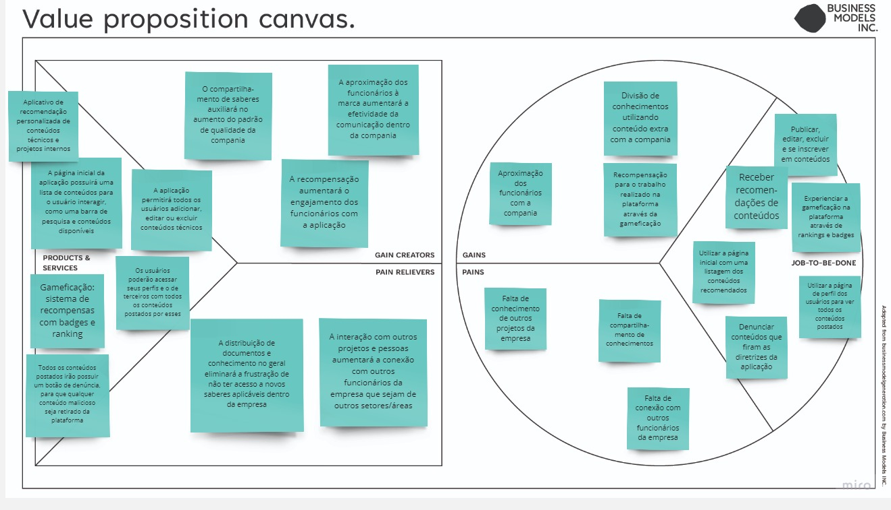

[template-documento1](../img/template-documento1.jpg)

<table>
<tr>
<table>
<tr>
<td>

</td>
<td>
</td>
</tr>
</table>

. Nome do Projeto: LearnLink   
. Nome do Parceiro: Dell   
. Nome do Grupo: Lírios  
. Integrantes do grupo:
  <a href="https://www.linkedin.com/in/bruno-omeira/"> Bruno Meira, 
  <a href="https://www.linkedin.com/in/gabrielriostorres/"> Gabriel Torres, 
  <a href="https://www.linkedin.com/in/liviapcoutinho/"> Livia Coutinho, 
  <a href="https://www.linkedin.com/in/marcos-vinicius-166531239/"> Marcos Vinicius,
  <a href="https://www.linkedin.com/in/matheusmacedosantos/"> Matheus Macedo,
  <a href="https://www.linkedin.com/in/liviapcoutinho/"> Raíssa Sabino e
  <a href="https://www.linkedin.com/in/yveslevi/"> Yves Lapa
	  

Template do Documento do Projeto
Módulo 6 - Engenharia de Software
Elaboração de aplicação para dispositivos móveis

>*Observação 1: A estrutura inicial deste documento é só um exemplo. O seu grupo deverá alterar esta estrutura de acordo com o que está sendo solicitado nos artefatos.*

>*Observação 2: O índice abaixo não precisa ser editado se você utilizar o Visual Studio Code com a extensão **Markdown All in One**. Essa extensão atualiza o índice automaticamente quando o arquivo é salvo.*

**Conteúdo**

- [Visão Geral do Projeto](#visão-geral-do-projeto)
  - [Parceiro de Negócios](#parceiro-de-negócios)
  - [Problema](#problema)
    - [Análise do Problema](#análise-do-problema)
    - [Matriz de avaliação de valor Oceano Azul](#matriz-de-avaliação-de-valor-oceano-azul)
    - [Proposta de Valor e Value Proposition Canvas](#proposta-de-valor-e-value-proposition-canvas)
    - [Matriz de Risco](#matriz-de-risco)
    - [Análise financeira do projeto](#análise-financeira-do-projeto)
    - [Mapeamento do processo](#mapeamento-do-processo)
  - [Descritivo da Solução](#descritivo-da-solução)
    - [Objetivos](#objetivos)
      - [Objetivos gerais](#objetivos-gerais)
      - [Objetivos específicos](#objetivos-específicos)
    - [Justificativa](#justificativa)
  - [Partes Interessadas](#partes-interessadas)
- [Requisitos](#requisitos)
  - [Requisitos Funcionais](#requisitos-funcionais)
  - [Requisitos não Funcionais](#requisitos-não-funcionais)
  - [Perfis de Usuários](#perfis-de-usuários)
  - [Casos de Uso](#casos-de-uso)
- [Arquitetura do Sistema](#arquitetura-do-sistema)
- [UX e UI Design](#ux-e-ui-design)
  - [Wireframes](#wireframes)
  - [Design de Interface - Guia de Estilos](#design-de-interface---guia-de-estilos)
- [Projeto de Banco de Dados](#projeto-de-banco-de-dados)
  - [Modelo Conceitual](#modelo-conceitual)
  - [Modelo Lógico](#modelo-conceitual)
- [Testes de Software](#testes-de-software)
  - [Teste Unitário](#teste-unitário)
  - [Teste de Integração](#teste-de-integração)
  - [Teste de Regressão](#teste-de-regressão)
  - [Teste de Usabilidade](#teste-de-usabilidade)
  - [Teste de Funcionalidade](#teste-de-funcionalidade)
  - [Teste de API](#teste-de-api)
- [Documentação da API](#documentação-da-api)
- [Manual do Usuário](#Manual-do-usuário)
- [Referências](#referências)
- [Apêndice](#apêndice)

# Visão Geral do Projeto
	

## Parceiro de Negócios

A Dell é uma empresa que foi criada em 1984 com o objetivo de oferecer acesso fácil à melhor tecnologia em todos os lugares do planeta. Estão entre as maiores empresas de tecnologia do mundo, sendo líder no mercado de computadores pessoais, servidores, dispositivos de armazenamento, soluções de segurança e soluções de rede, atuando com diversos recursos extraordinários . As aplicações da Dell vão desde soluções de nuvem híbrida e computação de alto desempenho até iniciativas de impacto social e sustentabilidade.

## Problema

Muitos profissionais de T.I se interessam por aprender novas tecnologias. Por exemplo, uma pessoa que trabalha com Front-end usando JavaScript quer aprender Ciência de Dados e programar em Python. Na Dell, alguns profissionais estão saindo da empresa por não estarem se sentindo desafiados e não estarem tendo oportunidades de ganhar novos conhecimentos no vasto mundo da programação.

### Análise do Problema

A problemática surge do fato de vários profissionais de tecnologia da Dell não estarem se sentindo desafiados e não terem oportunidades de aprender novas tecnologias, pois os times da Dell ficam centralizados em suas áreas respectivas e utilizam, na maioria das vezes, as mesmas linguagens e frameworks em todos os projetos. Tais razões fazem com que alguns funcionários saiam da instituição em busca de novos desafios e aprendizados. Com o objetivo de não perder esses desenvolvedores e como forma de engajar seus funcionários, a DELL precisa de uma aplicação web que consiga centralizar e conectar essa demanda dos funcionários de adquirirem novos conhecimentos com a oferta de projetos temporários que há na companhia.

### Matriz de avaliação de valor Oceano Azul

Definir 8 atributos que são importantes para os clientes e diferenciá-los da concorrência por meio das ações de Reduzir, Eliminar, Aumentar e Criar.

### Proposta de Valor e Value Proposition Canvas

### Matriz de Risco
	  
Abaixo está a matriz de risco do projeto, sendo elencadas as maiores ameaças e oportunidades com relação ao desenvolvimento do projeto:
	  

### Análise financeira do projeto
	  
A empresa Dell, a stakeholder do projeto, deseja um aplicativo móvel que possua front-end, back-end e banco de dados hospedados na AWS, além de um sistema de recomendação e gamificação. Considerando esses requisitos, a Dell pode ter que arcar com os seguintes custos:  

- Gastos com infraestrutura na nuvem: A AWS oferece um modelo de cobrança baseado no uso mensal de servidores. Portanto, o valor gasto nesse subtema varia de acordo com a quantidade e a qualidade dos servidores necessários para o projeto. Um exemplo de instância EC2 (para o back-end da aplicação) poderia ser a t2.micro, que custa cerca de US$ 0,0116 por hora. Se você executasse a instância por 24 horas por dia, sete dias por semana, o custo seria de cerca de US $8,46 por mês.  Já para o RDS (para o banco de dados da aplicação), considerando um banco de dados de 10 GB com 100.000 leituras/gravações por mês, custaria cerca de US $ 25,68 por mês. E, para o S3 (front-end da aplicação) com 10 GB de armazenamento e 100GB de transferência de dados, custaria cerca de US $0,22 por mês. Portanto, somando os custos mensais estimados de cada serviço, podemos ter uma estimativa geral de cerca de US $34,36 por mês para esse ambiente específico.  

- Manutenção do software: Como se trata de um MVP, o software precisará passar por melhorias e, após sua hospedagem, por manutenção. Para isso, serão necessários custos com desenvolvedores de back-end, front-end e infraestrutura. Além disso, pode ser necessário adaptar o aplicativo para obter um desempenho ou eficiência melhorados, o que pode levar a um gasto adicional de tempo e dinheiro para melhorias no código e infraestrutura.  
- Licença para distribuição do aplicativo: Para que os funcionários possam usar o aplicativo, ele precisa estar disponível em um serviço de distribuição digital de aplicativos móveis, como a Play Store, o Enterprise Program ou a App Store, por exemplo. Para manter o aplicativo nesses serviços, é preciso pagar uma taxa, que na App Store é de 99 dólares por ano, enquanto no Enterprise Program, indicado para empresas que desejam publicar aplicativos internos, a taxa chega a 299 dólares por ano.  
- Escalabilidade: Como se trata de uma empresa internacional, a Dell tem vários funcionários, e conforme a solução for disponibilizada para mais países, pode ser necessário fazer mudanças na infraestrutura ou no banco de dados da plataforma. Isso gera custos adicionais de manutenção e nuvem, como mencionado anteriormente.
Os gastos da criação e prototipação da aplicação não serão gastos, já que a empresa entrou em parceria com o Inteli para que a turma de Engenharia de Software faça um MVP do produto. Porém, considerando em uma análise geral, a empresa iria precisar de desenvolvedores Back-end, Front-end, Design - UX - e de Infraestrutura (DevOps). 
Abaixo está um exemplo de planilha de salários sobre tais funcionários: Porém podem ser necessários para futuras manutenções da plataforma.  
  
Considerando todos os gastos, exceto manutenção, temos anualmente que:  
  

Como retorno financeiro esperado, a empresa almeja solucionar o problema da evasão de funcionários, que acarreta prejuízos em termos de perda de conhecimento e habilidades de profissionais experientes, além de gerar custos adicionais com a contratação e treinamento de novos colaboradores. Além disso, a imagem da empresa perante o mercado, seus funcionários e potenciais novos integrantes seria beneficiada, uma vez que a solução proporcionará aos colaboradores a oportunidade de sentirem que suas carreiras estão evoluindo. Com isso, seriam fomentados profissionais engajados e, consequentemente, resultados mais expressivos seriam alcançados.

## Mapeamento do processo

Apresentar a modelagem do processo "to be", representando em alto nível o fluxo de trabalho a ser realizado dentro da solução.

## Descritivo da Solução

Descrição da solução a ser desenvolvida (o que é, quais principais funcionalidades, como usar) . Caso ainda não esteja definida a solução na Sprint 1, o faça assim que possível.

### Objetivos

Descrever o objetivo geral e os objetivos específicos.

#### Objetivos gerais

#### Objetivos específicos

### Justificativa

Descrever o tipo de arquitetura escolhida, sua justificativa, como deverá ser utilizada e quais os benefícios que ela proporciona.

## Partes Interessadas 

Descrever os principais stakeholders envolvidos no projeto e seus papéis.

# Requisitos

Os requisitos, funcionais e não funcionais, junto com a matriz de ratreabilidade e casos de uso se encontram na planilha abaixo:
<a href=https://docs.google.com/spreadsheets/d/1omDtc8WQxxAnrNdvlt_fXABqTSAwoPLrm8FABHv8-e0> M6 - Requisitos e Rastreabilidade

## Requisitos Funcionais
Esta seção da documentação do software fornece uma descrição detalhada dos requisitos do sistema. Ela inclui informações sobre as funcionalidades esperadas do software, as restrições e limitações do sistema e outras especificações relevantes.

## Requisitos não Funcionais
	  

## Perfis de Usuários 

A seção de perfil de usuário da documentação de software é responsável por descrever instruções detalhadas sobre o uso de cada opção e recursos relacionados ao perfil do usuário, garantindo uma experiência fácil e intuitiva para o usuário final.

## Casos de Uso

A seção de casos de uso da documentação de software é uma parte crucial que descreve as funcionalidades 
do software e como elas serão utilizadas pelos usuários. Aqui, são listados todos os cenários possíveis de uso do software, incluindo as ações que o usuário pode realizar, as interações com o sistema e os resultados esperados. Os casos de uso são descritos em detalhes, incluindo a descrição do objetivo da funcionalidade, as entradas de dados, as ações do usuário e os resultados esperados. Além disso, também são incluídos os critérios de aceitação, que são os padrões que o software precisa atender para ser considerado como funcionando corretamente.
  

[template-documento3](../img/template-documento3.jpg)

Exemplo de Diagrama de Casos de Uso

# Arquitetura do Sistema

Atualizar a cada revisão/atualização da arquitetura, mantendo todas as 3 versões no documento..

[template-documento4](../img/template-documento4.jpg)

Exemplo de Diagrama de Arquitetura

# UX e UI Design

Aborda o design e a funcionalidade da aplicação ou sistema em questão. Ela fornece informações sobre como o software é projetado para ser fácil de usar e intuitivo para os usuários. Nesta seção, deve ser possível encontrar descrições detalhadas sobre as principais características e recursos da interface do usuário, como botões, menus, ícones e outros elementos que são utilizados para facilitar a interação do usuário com o software. Além disso, são fornecidos exemplos de como as funcionalidades do software são acessadas e usadas pelos usuários, incluindo informações sobre os passos necessários para realizar tarefas específicas. Esta seção também aborda as principais preocupações de UX, como acessibilidade, usabilidade, consistência e simplicidade. São apresentados exemplos de como o software é projetado para atender às necessidades dos usuários com diferentes tipos de habilidades e recursos.

## Benchmark e Revisão de Design Systems
	
O benchmarking é uma técnica de análise comparativa que permite identificar as melhores práticas em um determinado campo, em relação aos concorrentes ou empresas de referência. No caso de um Design System, o benchmarking pode ser útil para avaliar a eficácia e a qualidade do sistema, além de obter insights sobre como melhorá-lo.
Análise comparativa entre o Design System utilizado no projeto e outros dois a serem selecionados pelo grupo – i.e. [Google Material Design](https://m3.material.io/), [IBM Carbon Design System](https://carbondesignsystem.com/), [Apple Human Interface Guidelines](https://developer.apple.com/design/human-interface-guidelines/guidelines/overview/), [Adobe Spectrum](https://spectrum.adobe.com/), [Microsoft Fluent Design System](https://www.microsoft.com/design/fluent/#/), [Atlassian Design System](https://atlassian.design/), [DSGov (Governo Federal)](https://www.gov.br/ds/home), [Shopify Polaris](https://polaris.shopify.com/), [Cloudscape](https://cloudscape.design/) etc. – com o objetivo de tornar mais assertivo o uso do Design System demandado para o projeto.
Alguns critérios de análise são: 
- Os DSs analisados são unificados, universais, pregnantes e conversacionais? Por quê?
- Em qual nível hierárquico (nascente, básico, integrado, distribuído e otimizado) cada um deles se encontra?
- Quais os pontos de fragilidade e força de cada um deles?

	
## Wireframes

Telas de baixa fidelidade das áreas do usuário, conectados, demonstrando a diagramação e o fluxo de navegação. Exemplos: home, login, dashboards etc. Em cada tela colocar: cabeçalho, rodapé, barra lateral, área de conteúdo.
	
Aqui você deve colocar o link para o wireframe e colocar as imagens geradas na sequência correta do fluxo de navegação. 
	
Recursos e funcionalidades de inclusão e acessibilidade já devem estar previstos nesse protótipo. 
	
O grupo deve demonstrar que a UI: (1) se adequa a diferentes contextos e necessidades do usuário, já que se trata de uma aplicação mobile, (2) é transparente, ou seja, atualiza o usuário de forma clara e precisa sobre cada processo que ocorre no sistema, (3) oferece feedbacks (visuais, textuais e, se aplicável, sonoros e táteis) rápidos/imediatos, (4) implementa linguagem amigável e personalizável para constituir uma experiência (4a) coerente com a identidade da marca e (4b) intuitiva e fluida, mitigando possíveis erros do usuário.
	

## Design de Interface  - Seleção de Estilos
	
Refere-se ao design visual, cores, tipografia, imagens, logotipos, ou seja, os elementos visuais que compõem o produto. Aqui você deve colocar o link para seu documento de guia de estilos e também colar as capturas de tela destes estilos.

# Projeto de Banco de Dados

Documento contendo diagrama de entidades e relacionamentos do banco de dados

## Modelo Conceitual

O modelo conceitual deve garantir uma conexão com a realidade. Os 4 tipos de conexões com a realidade são:
conceitos
atributos
identificações
associações
O Modelo Entidade-Relacionamento - MER
entidades e tipos de entidades
atributos e tipos de atributos
relacionamentos e tipos de relacionamentos

## Modelo Lógico 

O modelo lógico de banco de dados é uma representação abstrata e simplificada dos dados armazenados no sistema. É utilizado para entender como os dados são relacionados e para garantir a integridade e consistência dos dados armazenados. Incluir  uma descrição detalhada das tabelas, campos e relações presentes no modelo lógico de banco de dados. Também serão apresentadas as regras de negócio e as restrições aplicadas aos dados para garantir a integridade e a consistência dos dados armazenados.

# Testes de Software

## Teste Unitário

Link ou imagem da tabela com dados organizados dos testes realizados.

## Teste de Integração

Link ou imagem da tabela com dados organizados dos testes realizados.

## Teste de Regressão

Link ou imagem da tabela com dados organizados dos testes realizados.

## Teste de Usabilidade 

Link ou imagem da tabela com dados organizados dos testes realizados.

## Teste de Funcionalidade 

Link ou imagem da tabela com dados organizados dos testes realizados.

## Teste de API 

Link ou imagem da tabela com dados organizados dos testes realizados.

# Documentação da API

Apresentar a documentação no formato Swagger ou aplicação equivalente com todas as requisições dos endpoints desenvolvidos e funcionando.

# Manual do Usuário

Fornecer instruções detalhadas sobre como usar o software corretamente. É uma ferramenta valiosa para ajudar os usuários a compreender as funções do software, instalar o software, configurar as preferências do usuário, entre outras tarefas. O manual do usuário geralmente inclui screenshots, animações e outros recursos visuais para tornar a experiência do usuário mais clara e intuitiva. Além disso, ele também pode incluir informações sobre solução de problemas, dicas e truques, bem como informações de contato para suporte técnico. É importante que a seção de manual do usuário seja atualizada frequentemente para garantir que os usuários tenham acesso à informação mais recente e precisa sobre o software.

# Referências

Toda referência citada no texto deverá constar nessa seção, utilizando o padrão de normalização da ABNT - ABNT NBR 10520). As citações devem ser confiáveis e relevantes para o trabalho. São imprescindíveis as citações dos sites de download das ferramentas utilizadas, bem como a citação de algum objeto, música, textura ou outros que não tenham sido produzidos pelo grupo, mas utilizados (mesmo no caso de licenças gratuitas, royalty free ou similares).
Sugerimos o uso do sistema autor-data para citações.

# Apêndice 

Os apêndices representam informações adicionais que não caberiam no documento exposto acima, mas que são importantes por alguma razão específica do projeto. 
